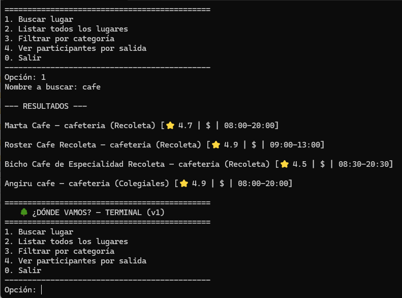
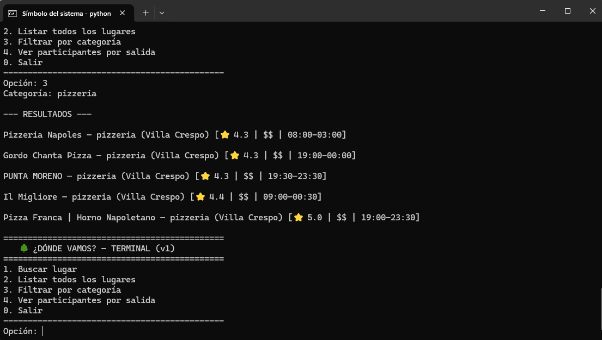
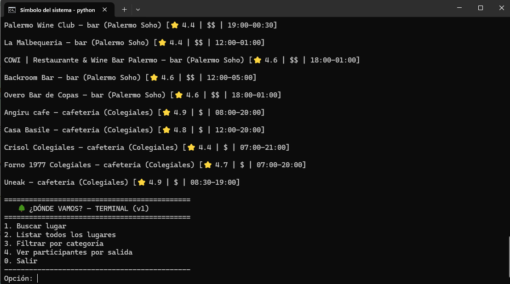

# ¿Dónde vamos?

Proyecto integrador de **Estructura de Datos**, desarrollado en Python.

## Descripción

¿Dónde vamos? es un sistema que ayuda a parejas o grupos pequeños de amigos a
encontrar y organizar una salida considerando sus preferencias y presupuesto.

Su **v2** (TP1 + TP2 + TP3) permite:

- **Buscar un lugar** por coincidencia parcial (recorrido lineal sobre la lista).
- **Buscar por nombre exacto** comparando **tres estrategias** de búsqueda: secuencial O(n), binaria O(log n) sobre lista ordenada, y árbol binario de búsqueda O(log n). La opción 5 de la terminal deja elegir y cronometra cada una.
- **Listar** todos los lugares en orden de carga o **en orden alfabético** (recorrido *inorder* del árbol).
- **Filtrar** por categoría y **ver** los participantes de cada salida.

El árbol binario de búsqueda del TP3 se integró como **índice complementario**, no
como reemplazo de la lista: `filtrar` y la búsqueda parcial siguen siendo lineales a
propósito, porque el árbol no puede responderlas en O(log n).

## Estado del proyecto

| TP | Tema | Estado |
|---|---|---|
| TP0 | Propuesta y lanzamiento | ✅ |
| TP1 | Objetos y clases — modelo, catálogo y terminal v1 | ✅ |
| TP2 | Análisis de algoritmos — secuencial vs binaria | ✅ |
| TP3 | Árbol binario de búsqueda | ✅ |
| TP4 | AVL | ⏳ |
| TP5 | Árbol general | ⏳ |
| TP6 | Heap (Top 10 de lugares) | ⏳ |
| TP7 | Grafo (lugares relacionados) | ⏳ |
| TP8 | BFS / DFS | ⏳ |
| TP9 | Caminos mínimos (Dijkstra) | ⏳ |
| TP10 | Producto final | ⏳ |

## Ejecución

```bash
python main.py
```

No requiere instalar nada: solo Python 3.10 o superior y la biblioteca estándar.

## Pruebas

```bash
python -m unittest discover tests
```

68 pruebas (`tests/test_catalogo.py` y `tests/test_arbol_binario.py`), sin
dependencias externas.

## Experimentos

```bash
python datos/generar.py                       # datasets sintéticos (100 a 100.000)
python algoritmos/experimentos/medicion.py    # mide las tres estrategias
python algoritmos/experimentos/grafico.py     # guarda docs/capturas/experimento-tp3.png
```

- Informe TP2 (secuencial vs binaria): [`docs/tp2-experimentos.md`](docs/tp2-experimentos.md)
- Informe TP3 (agrega el BST): [`docs/tp3-arbol-binario.md`](docs/tp3-arbol-binario.md)

## Documentación

| Doc | Contenido |
|---|---|
| [`docs/01-requerimientos.md`](docs/01-requerimientos.md) | Alcance, RF/RNF con estado estable, criterios de aceptación y observaciones |
| [`docs/02-casos-de-uso.md`](docs/02-casos-de-uso.md) | Diagrama general y 5 casos de uso textuales |
| [`docs/03-diagrama-clases.md`](docs/03-diagrama-clases.md) | Clases del dominio, `Catalogo` y la nueva `ArbolBinarioBusqueda` |
| [`docs/04-diagrama-datos.md`](docs/04-diagrama-datos.md) | Flujo de datos: de los JSON crudos a la terminal, pasando por cada estructura |
| [`docs/05-gestion-proyecto.md`](docs/05-gestion-proyecto.md) | Tablero, sprints, historias de usuario y retros |

## Demo

| | |
|---|---|
|  |  |
| Buscar lugar (v1) | Filtrar por categoría (v1) |



## Estructura del repositorio

```text
TP0_Donde_Vamos/
├── main.py
├── README.md
├── .gitignore
├── docs/
│   ├── 01-requerimientos.md
│   ├── 02-casos-de-uso.md
│   ├── 03-diagrama-clases.md
│   ├── 04-diagrama-datos.md
│   ├── 05-gestion-proyecto.md
│   ├── tp2-experimentos.md
│   ├── tp3-arbol-binario.md
│   └── capturas/
├── modelos/
│   ├── lugar.py
│   └── salida.py
├── servicios/
│   └── catalogo.py          ← búsqueda secuencial, binaria y BST
├── estructuras/
│   └── arbol_binario.py     ← TP3: NodoArbol y ArbolBinarioBusqueda
├── ui/
│   └── terminal.py          ← v2 (opción 5: comparar estrategias)
├── datos/
│   ├── lugares.json
│   ├── salidas.json
│   └── generar.py           ← TP2: datasets sintéticos (los generados están en .gitignore)
├── algoritmos/
│   └── experimentos/
│       ├── medicion.py      ← TP2 + TP3
│       └── grafico.py
└── tests/
    ├── test_catalogo.py
    └── test_arbol_binario.py
```

## Evolución

En **TP0** se documentó la propuesta y se preparó el repositorio. En **TP1** se
implementó la v1: modelo de dominio, catálogo con búsqueda exacta y parcial sin
distinguir mayúsculas, terminal desacoplada de la lógica y un dataset de 50 lugares
reales de CABA. En **TP2** se analizó la complejidad de la búsqueda por nombre,
comparando la estrategia secuencial (O(n)) con una binaria sobre lista ordenada
(O(log n)) y verificando el RNF01 con datasets de 100 a 100.000 lugares. En **TP3**
se implementó el árbol binario de búsqueda, se integró al catálogo como tercera
estrategia de búsqueda exacta y como fuente del listado alfabético, y se comparó
contra las dos anteriores **sin cambiar la metodología** del TP2.

El resultado del TP3 fue incómodo y quedó documentado tal cual: el BST **no le ganó
a `bisect`** en velocidad de búsqueda (`bisect` es código C), pero resuelve la
inserción en O(log n) sin reordenar toda la lista. Además degenera a O(n) si las
claves llegan ordenadas, que es exactamente lo que nos pasó al medir el costo de
preparación. Ver [`docs/tp3-arbol-binario.md`](docs/tp3-arbol-binario.md) §8 y §9.
