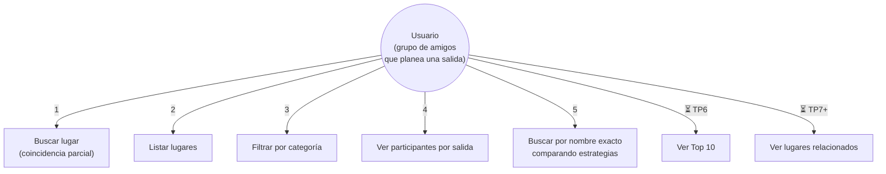

# Casos de uso — ¿Dónde vamos?

> Actualizado en TP3. Formato de la consigna: Actor, Precondición, Flujo
> principal, Flujo alternativo, Postcondición.

## Diagrama general

El actor es **una sola persona**: el usuario objetivo definido en TP0 (una pareja
o un grupo pequeño de amigos). No hay administradores ni otros actores.

---

## Caso de uso: Buscar lugar (parcial)

- **Actor**: Usuario
- **Precondición**: el catálogo está cargado.
- **Flujo principal**:
  1. El usuario selecciona "Buscar lugar".
  2. El sistema pide el nombre o parte del nombre.
  3. El usuario ingresa el texto.
  4. El sistema busca las coincidencias parciales (sin distinguir mayúsculas ni tildes).
  5. El sistema muestra todos los lugares encontrados.
- **Flujo alternativo**: si no hay coincidencias, el sistema informa que no encontró nada.
- **Postcondición**: el usuario vio los datos de los lugares encontrados. El catálogo no se modifica.

## Caso de uso: Listar todos los lugares

- **Actor**: Usuario
- **Precondición**: el catálogo está cargado.
- **Flujo principal**:
  1. El usuario selecciona "Listar todos los lugares".
  2. El sistema pregunta en qué orden.
  3. El usuario elige orden de carga (la lista) u orden alfabético (recorrido inorder del árbol).
  4. El sistema muestra el catálogo completo en el orden elegido.
- **Flujo alternativo**: si el catálogo está vacío, el sistema avisa que no hay lugares.
- **Postcondición**: el usuario recorrió el catálogo. Ninguna estructura se modifica.

## Caso de uso: Filtrar por categoría

- **Actor**: Usuario
- **Precondición**: el catálogo está cargado.
- **Flujo principal**:
  1. El usuario selecciona "Filtrar por categoría".
  2. El sistema pide una categoría.
  3. El usuario ingresa la categoría (ej. parrilla, bar, cafeteria).
  4. El sistema muestra solo los lugares de esa categoría (sin distinguir mayúsculas).
- **Flujo alternativo**: si no hay lugares en esa categoría, el sistema lo informa.
- **Postcondición**: el usuario vio los lugares de la categoría indicada.

## Caso de uso: Ver participantes por salida

- **Actor**: Usuario
- **Precondición**: el catálogo y las salidas están cargados.
- **Flujo principal**:
  1. El usuario selecciona "Ver participantes por salida".
  2. El sistema recorre las salidas cargadas.
  3. Para cada salida muestra su nombre y la lista de participantes.
- **Flujo alternativo**: si no hay salidas cargadas, el sistema no muestra resultados.
- **Postcondición**: el usuario vio quién asiste a cada salida.

## Caso de uso: Buscar por nombre exacto comparando estrategias

- **Actor**: Usuario
- **Precondición**: el catálogo está cargado e indexado.
- **Objetivo**: encontrar un lugar por nombre completo y ver cómo lo resuelven las tres estructuras de búsqueda.
- **Flujo principal**:
  1. El usuario selecciona "Buscar por nombre exacto (comparar estrategias)".
  2. El sistema pide el nombre completo del lugar.
  3. El usuario elige con qué estrategia buscar: secuencial, binaria, árbol BST, o las tres.
  4. El sistema normaliza el nombre (minúsculas, sin tildes) y ejecuta la búsqueda elegida.
  5. El sistema muestra el lugar encontrado y el tiempo que tardó cada estrategia.
- **Flujo alternativo**: si el nombre no existe, cada estrategia informa que no lo encontró y devuelve `None`.
- **Postcondición**: el usuario vio el lugar y el tiempo de cada estrategia. Si usó la binaria, el catálogo quedó ordenado alfabéticamente (es el requisito de `buscar_binaria`).

---

## Casos pendientes de implementar (TPs siguientes)

## Caso de uso (futuro): Ver Top 10

- **Actor**: Usuario
- **Objetivo**: consultar los diez lugares mejor valorados.
- **Nota**: se implementa cuando entren las estructuras de ordenamiento (heap, TP6).

## Caso de uso (futuro): Recibir sugerencias

- **Actor**: Usuario
- **Objetivo**: obtener lugares compatibles con las preferencias, las fechas y el presupuesto del grupo.
- **Nota**: se implementa cuando entren los grafos/relaciones entre lugares (TP7+).
