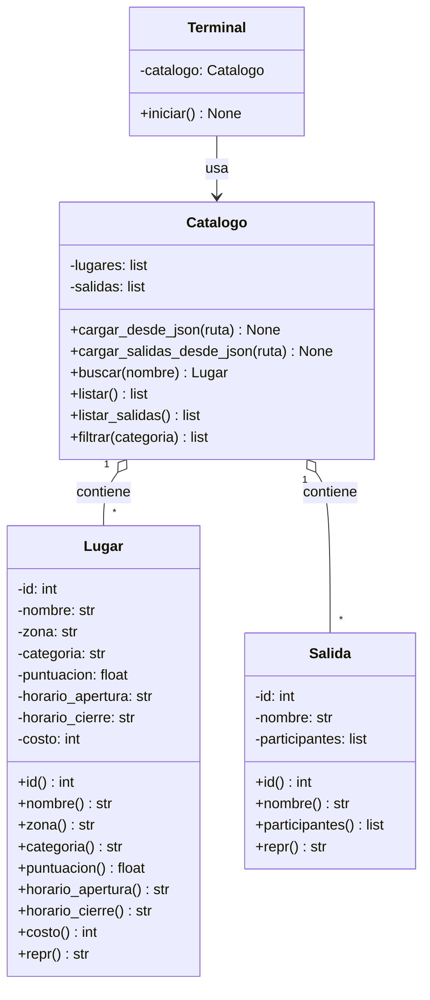

# Diagrama de clases

> Actualizado en TP1 con la implementación de la v1.

La clase `Salida` se incorporó en la v1 en su versión mínima (id, nombre y lista de participantes), y se va a completar en etapas posteriores (fechas, presupuesto, lugares elegidos) cuando se implementen F4/F5.