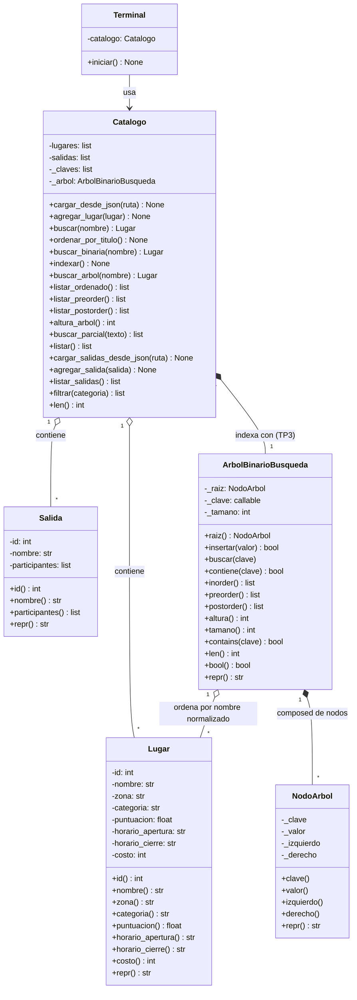

# Diagrama de clases

> Estado: TP3. Se actualiza en cada etapa con la estructura nueva.
> Una clase por estructura; solo se dibujan las que existen.

```mermaid
classDiagram

    class Lugar {
        -id: int
        -nombre: str
        -zona: str
        -categoria: str
        -puntuacion: float
        -horario_apertura: str
        -horario_cierre: str
        -costo: int
        +id() int
        +nombre() str
        +zona() str
        +categoria() str
        +puntuacion() float
        +horario_apertura() str
        +horario_cierre() str
        +costo() int
        +repr() str
    }

    class Salida {
        -id: int
        -nombre: str
        -participantes: list
        +id() int
        +nombre() str
        +participantes() list
        +repr() str
    }

    class Catalogo {
        -lugares: list
        -salidas: list
        -_claves: list
        -_arbol: ArbolBinarioBusqueda
        +cargar_desde_json(ruta) None
        +agregar_lugar(lugar) None
        +buscar(nombre) Lugar
        +ordenar_por_titulo() None
        +buscar_binaria(nombre) Lugar
        +indexar() None
        +buscar_arbol(nombre) Lugar
        +listar_ordenado() list
        +listar_preorder() list
        +listar_postorder() list
        +altura_arbol() int
        +buscar_parcial(texto) list
        +listar() list
        +cargar_salidas_desde_json(ruta) None
        +agregar_salida(salida) None
        +listar_salidas() list
        +filtrar(categoria) list
        +len() int
    }

    class NodoArbol {
        -_clave
        -_valor
        -_izquierdo
        -_derecho
        +clave()
        +valor()
        +izquierdo()
        +derecho()
        +repr() str
    }

    class ArbolBinarioBusqueda {
        -_raiz: NodoArbol
        -_clave: callable
        -_tamano: int
        +raiz() NodoArbol
        +insertar(valor) bool
        +buscar(clave)
        +contiene(clave) bool
        +inorder() list
        +preorder() list
        +postorder() list
        +altura() int
        +tamano() int
        +contains(clave) bool
        +len() int
        +bool() bool
        +repr() str
    }

    class Terminal {
        -catalogo: Catalogo
        +iniciar() None
    }

    Terminal --> Catalogo : usa
    Catalogo "1" o-- "*" Lugar : contiene
    Catalogo "1" o-- "*" Salida : contiene
    Catalogo "1" *-- "1" ArbolBinarioBusqueda : indexa con (TP3)
    ArbolBinarioBusqueda "1" *-- "*" NodoArbol : composed de nodos
    ArbolBinarioBusqueda "1" o-- "*" Lugar : ordena por nombre normalizado
```

## Qué cambió en cada etapa

| TP | Cambio en el diagrama |
|---|---|
| TP1 | `Lugar`, `Catalogo`, `Salida`, `Terminal` reales; `Salida` en versión mínima. |
| TP2 | `Catalogo` gana `_claves`, `ordenar_por_titulo()` y `buscar_binaria()`: la lista ordenada pasó a ser una segunda estructura de búsqueda. |
| TP3 | `Catalogo` gana `_arbol`, `indexar()`, `buscar_arbol()`, `listar_ordenado()`, `listar_preorder()`, `listar_postorder()` y `altura_arbol()`; aparecen `ArbolBinarioBusqueda` y `NodoArbol`. |

## Notas

- **`agregar_lugar()` mantiene el árbol al día.** Agrega el lugar a la lista y lo
  inserta en el árbol en la misma operación, así que no hace falta llamar a
  `indexar()` después. Si el nombre ya estaba, `insertar` actualiza el nodo
  existente en vez de duplicarlo: la lista crece y el árbol no.

- **La lista no se reemplaza.** `Catalogo` sigue teniendo `_lugares` como lista y la
  sigue usando para `filtrar` y `buscar_parcial`, que son recorridos lineales. El
  árbol entra *al lado*, como índice de búsqueda exacta y como fuente del listado
  alfabético. La relación `Catalogo "1" *-- "1" ArbolBinarioBusqueda` muestra que
  hay uno solo por catálogo.
- **`ArbolBinarioBusqueda` es genérica.** Guarda la función de clave (`-_clave`) en
  vez de conocer a `Lugar`: el mismo árbol sirve para cualquier tipo. La relación
  `ArbolBinarioBusqueda --> Lugar` es por el uso concreto en este sistema, no una
  dependencia del código — `estructuras/arbol_binario.py` no importa nada de
  `servicios/` ni de `modelos/`.
- **`ArbolBST` en la plantilla de la consigna se llama acá `ArbolBinarioBusqueda`**,
  para dejar claro que no es un AVL ni un árbol general: no balancea y solo ordena
  por la clave inyectada.
- `Salida` se incorporó en la v1 en su versión mínima (id, nombre y participantes) y
  se completa cuando se implementen RF04/RF05.
