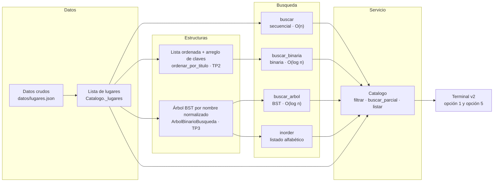

# Conexión entre estructuras

> Diagrama de flujo de datos del sistema. Se actualiza en cada TP con la
> estructura nueva.
>
> (El archivo se llama `04-diagrama-datos.md`, pero el contenido es la
> *conexión entre estructuras*: **el flujo de datos, no las clases.** Las
> clases van en [`03-diagrama-clases.md`](03-diagrama-clases.md).)

## Diagrama

## Qué aporta cada estructura

| Estructura | Qué resuelve | Por qué sigue existiendo |
|---|---|---|
| **Lista de lugares** | Recorridos lineales: `filtrar` por categoría, `buscar_parcial` (coincidencia parcial), `listar` en orden de carga | El BST **no** puede hacer búsqueda parcial: para eso hay que recorrerlo entero, O(n). La lista no se reemplaza, se complementa. |
| **Lista ordenada + `_claves`** | `buscar_binaria` en O(log n) | Es la estrategia del TP2. Se conserva como comparación y para catálogos que nunca mutan. |
| **Árbol BST** | `buscar_arbol` en O(log n) **y** inserción en O(log n) sin reordenar todo | La lista ordenada obliga a un `sort` de O(n log n) por cada lugar nuevo; el árbol inserta en O(log n) sin tocar el resto. |

## Dónde entra cada operación

1. **Carga**: `cargar_desde_json` arma la lista y llama a `indexar()`, que inserta cada lugar en el BST en orden de carga. `ordenar_por_titulo()` se llama aparte, cuando hace falta la binaria.
2. **Búsqueda exacta** (opción 5 de la terminal): las tres estrategias reciben el mismo nombre, lo normalizan con `_normalizar` y devuelven la **misma instancia** de `Lugar` (o `None`).
3. **Búsqueda parcial** (opción 1): sigue siendo lineal sobre la lista, a propósito.
4. **Listado**: en orden de carga (la lista) o alfabético (el `inorder` del árbol).

Este diagrama muestra solo lo implementado. Las tres estrategias conviven: la
terminal ofrece las tres en la opción 5, y los recorridos que no son de búsqueda
exacta siguen yendo a la lista.
