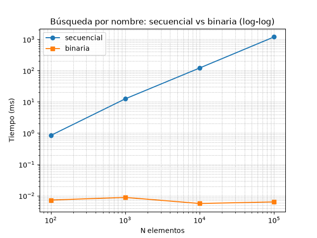

# TP2 — Análisis de complejidad: búsqueda secuencial vs binaria

## 1. Operación crítica elegida

**Búsqueda por nombre en el catálogo** (`Catalogo.buscar` / `Catalogo.buscar_binaria`).

Es la operación que el usuario ejecuta más (menú "Buscar lugar") y, en términos de complejidad, es la que va a justificar al árbol binario de búsqueda del TP3 y al AVL del TP4: si la búsqueda por nombre es una operación central y frecuente, su costo importa cuando el catálogo crece.

## 2. Estrategias comparadas

| ID | Estrategia | Implementación |
|---|---|---|
| A | **Secuencial** | `Catalogo.buscar` (TP1): recorre la lista hasta encontrar el nombre normalizado (minúsculas, sin tildes) o agotarla. |
| B | **Binaria** | `Catalogo.buscar_binaria` (`bisect.bisect_left` sobre lista ordenada por nombre normalizado). |

El árbol BST **no forma parte de este TP** (es el TP3); la búsqueda binaria sobre lista ordenada es la segunda estrategia sin implementar una estructura nueva.

## 3. Datos de prueba

Datasets sintéticos generados con `datos/generar.py` (mismo esquema que `datos/lugares.json`):

```
python datos/generar.py
```

- **100, 1.000, 10.000 y 100.000** lugares.
- Nombres `Lugar {i}` (i = 0 … n-1); zonas, categorías, puntuación, horarios y costos aleatorios.
- Los archivos generados (`datos/lugares_{n}.json`) están en `.gitignore`: el generador es reproducible y se commitea, los datasets no.

## 4. Método de medición

`python algoritmos/experimentos/medicion.py`

- **`timeit`**, con **20 ejecuciones × 5 repeticiones**, y se conserva el **mínimo por llamada** (el mínimo es "el mejor esfuerzo de la máquina"; el promedio se contamina con el único día lento del SO).
- **Warm-up**: una llamada de cada estrategia antes de cronometrar (el import + las primeras ejecuciones no se miden).
- **Carga y ordenamiento fuera del cronómetro**: `cargar_desde_json` y `ordenar_por_titulo` se ejecutan antes; se mide solo la consulta. El costo de ordenar (O(n log n)) no contamina la búsqueda.
- **Misma consulta en ambas estrategias**: `"Lugar {n-1}"`, un elemento que **existe** (buscar uno inexistente recorrería todo en ambas y disfrazaría la diferencia).
- Se repitió la medición y se tomó el **mínimo** por tamaño. Los valores reportados corresponden a la misma corrida que genera el gráfico (20 ejecuciones × 5 repeticiones, mínimo por llamada), de modo que tabla e imagen son consistentes.

Equipo de prueba: Windows + Python 3.14.0.

## 5. Resultados

| N elementos | Secuencial (ms) | Binaria (ms) | Crecimiento observado (secuencial) |
|---|---:|---:|---:|
| 100 | 0,8431 | 0,0072 | base |
| 1.000 | 12,484 | 0,0088 | ~15x |
| 10.000 | 121,073 | 0,0056 | ~10x |
| 100.000 | 1.195,028 | 0,0063 | ~10x |



El gráfico se genera con `python algoritmos/experimentos/grafico.py` y se guarda en `docs/capturas/experimento-tp2.png`. En escala log-log, secuencial se ve como una recta de pendiente 1 (lineal) y binaria como una recta horizontal (logarítmica).

## 6. Análisis de complejidad

| Estrategia | Mejor caso Ω | Peor caso O | Caso típico Θ |
|---|---|---|---|
| Secuencial (`buscar`) | Ω(1): el elemento está primero | O(n): recorre los n lugares | Θ(n): en promedio recorre ~n/2, proporcional a n |
| Binaria (`buscar_binaria`) | Ω(1): cae en la posición central | O(log n): descarta la mitad en cada paso | Θ(log n) |
| Ordenar antes de binaria (una vez) | Ω(n log n) | O(n log n) | Θ(n log n); pagado una vez, se amortiza |

**Búsqueda secuencial**: recorre la lista hasta encontrar el elemento. En el peor caso recorre los **n** elementos → **O(n)**; el caso típico es proporcional a n/2, es decir **Θ(n)**.

**Búsqueda binaria**: en cada paso descarta la mitad del espacio de búsqueda sobre la lista ordenada; a lo sumo **log₂(n)** comparaciones → **O(log n)**, y en promedio **Θ(log n)**. A cambio exige que el catálogo esté ordenado: **O(n log n) al cargar, una sola vez**.

## 7. Conclusión

La conclusión no es "la binaria es más rápida". Es:

1. **Qué se comparó**: la misma operación (búsqueda exacta por nombre), con los mismos datos y la misma consulta (`Lugar {n-1}`), en ambas estrategias.
2. **Qué dice la tabla**: cuando n aumenta ×10, la secuencial multiplica su tiempo por ~10 (de 10.000 a 100.000 pasa de ~121 ms a ~1.195 ms; el salto inicial de 100 a 1.000 es más ruidoso), mientras que la binaria permanece plana en la práctica (menos de 0,01 ms en todos los tamaños).
3. **Por qué**: complejidad asintótica. La secuencial es **O(n)**; descartar un elemento por vez significa que crece a la misma velocidad que los datos. La binaria es **O(log n)**: crece tan despacio que en la tabla apenas se nota.
4. **Cuál conviene y por qué**: para un catálogo que se consulta constantemente por nombre y no muta en cada consulta, la estrategia ordenada (binaria ahora; el BST del TP3 será su evolución natural) es la indicada: el costo de ordenar se paga una vez al cargar y se amortiza en cada búsqueda. La secuencial sigue siendo más simple de implementar y conviene si el catálogo es chico o muta mucho (ordenar también cuesta O(n log n)).
5. **Qué se aprende del experimento**: con 100 elementos ambas "andan igual" (menos de 1 ms) — eso también es un dato: la diferencia solo se nota cuando el volumen crece, que es justo el escenario del requerimiento RNF01 (respuesta aceptable con más de 1.000 lugares).

**Párrafo modelo**

> Con 1.000 elementos la diferencia es imperceptible al ojo («ambas responden en el momento»), pero a 100.000 la secuencial tarda más de 1,2 segundos y la binaria sigue por debajo de 0,01 ms. La complejidad lo explica exactamente: O(n) vs O(log n). Para un catálogo que se consulta por nombre y no muta en cada consulta, la estrategia ordenada (binaria ahora, árbol en TP3) es la indicada: el costo de ordenar se paga una vez y se amortiza. (Nota al margen: los valores absolutos dependen de la máquina; lo reproducible es el *patrón* de crecimiento y el script que lo genera.)

## Reproducción

```bash
python datos/generar.py                       # genera los datasets sintéticos
python algoritmos/experimentos/medicion.py    # mide y muestra la tabla
python -m unittest discover tests             # verifica ambas estrategias
```