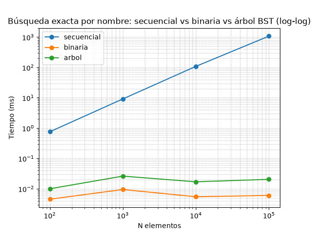
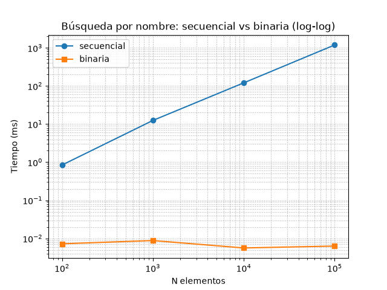

# TP3 — Árbol binario de búsqueda

> Informe escrito como lo voy a explicar en la defensa: qué elegí, qué medí y
> qué me pasó. Los números son de la corrida que generó el gráfico.

## 1. La operación que elegí

Empecé por lo mismo que en el TP2: la **búsqueda exacta por nombre**
(`Catalogo.buscar_arbol`).

Es la operación que el usuario más ejecuta y la única que crece con el catálogo.
Acá tomé una decisión de diseño importante: **no inventé una operación nueva**.
El enunciado del TP3 pide comparar el árbol contra lo que ya teníamos, y si
medía una operación distinta, la comparación con el TP2 no significaba nada. Así
que el árbol entra como **tercera estrategia sobre la misma operación**, y las
tres miden exactamente lo mismo.

## 2. La clave: por qué el nombre normalizado

La clave del árbol es **el nombre normalizado**, o sea minúsculas y sin tildes, la
misma clave que ya usaban `buscar` (TP1) y `buscar_binaria` (TP2).

Las razones son dos. La primera es de comparabilidad: si el árbol ordenara por otra
cosa, estaría midiendo otra operación y la tabla del TP2 no me serviría como
contraste. La segunda es de producto: el usuario no conoce el formato exacto de los
datos, escribe `"LA BIELA"` o `"gastronomia"` con o sin tilde y tiene que encontrarlo
igual. O sea, la normalización no es un detalle técnico, es parte del requisito.

Antes de decidirlo miré las otras claves que tenía disponibles y las descarté:

| Clave candidata | Por qué la descarté |
|---|---|
| `puntuacion` | Sirve para el Top 10, pero rompe la continuidad con el TP2 y obliga a desempatar por nombre. Esa es la clave del heap del TP6. |
| `costo` | Tiene muchísimos empates (1, 2 o 3) y el BST no admite claves repetidas: dos lugares con el mismo costo no pueden convivir. |
| `id` | Es única y barata, pero no le significa nada al usuario. Buscar "La Biela" por id no resuelve nada. |

Acá hay un detalle de diseño que me pareció más elegante que hacerlo de la otra
forma: en vez de que el árbol sepa del dominio, **le inyecté la clave como
`callable`** (`ArbolBinarioBusqueda(clave=...)`). Entonces
`estructuras/arbol_binario.py` no importa nada de `servicios/` y ni menciona
`_normalizar`. Eso tiene tres beneficios: el árbol es reutilizable con cualquier
tipo, no dependemos de un nombre privado, y la invariante más importante —que las
tres estrategias ordenan por la misma cosa— se ve en una línea, en el `lambda` que
le pasa el catálogo.

## 3. Qué implementé

En `estructuras/arbol_binario.py` hay dos clases.

`NodoArbol` es el nodo: clave, valor y los dos hijos, todo con `@property` de solo
lectura, igual que hicimos con `Lugar` en el TP1. La única cosa que puede mutar es
el valor, y a través de un método privado `_reemplazar_valor`, que existe para el
caso de clave duplicada. La clave de un nodo no se toca nunca: si se pudiera
cambiar, el nodo se movería de lugar y se rompería el orden del árbol.

`ArbolBinarioBusqueda` tiene:

- `insertar(valor) -> bool`: devuelve `True` si agregó el valor y `False` si la
  clave ya existía. Cuando ya existía **actualiza el valor** del nodo en lugar de
  crear un duplicado. Es la misma decisión que tomamos en el TP2 con
  `bisect_left` + verificación de igualdad.
- `buscar(clave)` y `contiene(clave)`.
- Los tres recorridos: `inorder()`, `preorder()` y `postorder()`.
- `altura()`, `tamano()`, `__len__`, `__bool__` y `__contains__`.

**Todo es iterativo, con pila explícita.** Y esto para mí no fue un capricho
estilístico: la razón se me hizo evidente cuando pensé en el peor caso. Un BST
sin balancear que recibe las claves ya ordenadas se convierte en una lista enlazada
de altura n. Con n = 100.000, una versión recursiva se comería el límite de
recursión de Python, que es 1000. La versión iterativa tiene exactamente la misma
complejidad y no explota. Y no lo digo de palabra: hay un test
(`test_altura_no_revienta_con_orden_de_insercion_peor`) que indexa 2.000 claves en
orden inverso justamente para que, si alguien reintroduce la recursión, falle.

Un detalle de contrato que conviene que quede claro: `insertar` deriva la clave del
valor que le paso, pero `buscar` recibe la clave **ya normalizada**. No puede ser de
otra manera, porque la función de clave transforma un *valor* en su clave —no puede
aplicarse a lo que el usuario tipea en el teclado—. Entonces quien normaliza es
`Catalogo`, igual que ya hacía con `buscar_binaria`.

## 4. Cómo lo integré a la aplicación

Ací me pareció importante no dejar esto como una estructura de laboratorio. El
árbol es **el índice de búsqueda exacta del catálogo**:

- `Catalogo.indexar()` construye el árbol al cargar. Lo hice explícito y público, a
  imagen de `ordenar_por_titulo()`, para que quede a la vista cuándo se paga el
  costo.
- `Catalogo.buscar_arbol(nombre)` es la tercera estrategia, con la misma firma y la
  misma semántica que las otras dos: devuelve el mismo `Lugar` o `None`.
- `Catalogo.listar_ordenado()` le da un uso real al `inorder`: es el listado
  alfabético de la opción 2 de la terminal.
- `Catalogo.listar_preorder()` y `Catalogo.listar_postorder()` exponen los otros dos
  recorridos del árbol. No están en la terminal a propósito: muestran la FORMA del
  árbol, no un orden de catálogo, así que son para inspección y pruebas.
- `Catalogo.agregar_lugar(lugar)` agrega un lugar a la lista y lo inserta en el
  árbol en la misma operación, sin reindexar.
- `Catalogo.altura_arbol()` expone el balance, que usan las pruebas y este informe.

En la terminal v2 la **opción 5** pide un nombre, deja elegir con qué estrategia
buscar —secuencial, binaria, árbol o las tres— y cronometra cada una con
`perf_counter`, mostrando el resultado de todas.

Y un punto donde me detuve a pensar, porque es la decisión de diseño que más se
discute:
**la lista no se reemplaza, el árbol la complementa.** `filtrar` y `buscar_parcial`
siguen siendo lineales sobre la lista, a propósito. El BST puede contestar una
búsqueda exacta, pero no una coincidencia parcial como "palermo": para eso habría
que recorrer el árbol entero, que es O(n). Sacar la lista y dejar solo el árbol
habría sido quedarme sin dos funcionalidades que ya funcionan.

### 4.1 El merge del TP3

El árbol lo subió primero una de las dos personas del equipo y después la otra
mandó su propia versión del mismo árbol y del catálogo. Eran dos
implementaciones en paralelo del mismo concepto, así que hubo que decidir cuál se
quedaba. Nos quedamos con `estructuras/arbol_binario.py` por tres razones
concretas:

| Criterio | `estructuras/arbol_binario.py` (la que quedó) | La otra versión |
|---|---|---|
| Acoplamiento al dominio | Genérica: recibe la clave como `callable` | El nodo guardaba un `lugar` y comparaba `nombre` |
| Recursión | Todo iterativo con pila explícita | Recursiva, y explota con inserciones ordenadas |
| Reutilización | Sirve para cualquier tipo, se testea con enteros | Solo con lugares |

De su versión conservamos lo que aportaba y faltaba: la exposición de `preorder` y
`postorder` a través del catálogo (`listar_preorder`, `listar_postorder`) y los
métodos de alta incremental (`agregar_lugar`, `agregar_salida`). Lo que no se
adoptó fue su `Catalogo`, porque reemplazaba al existente y perdía la carga desde
JSON, la búsqueda binaria, la normalización con acentos y las pruebas del TP2.

### 4.2 El bug que encontró el merge

`postorder()` estaba mal implementado y las pruebas no lo detectaban. La versión
anterior usaba un nodo "último visitado" para decidir si el subárbol izquierdo ya
estaba terminado, y comparaba ese valor contra `(nodo.izquierdo, nodo.derecho)`.
El problema es que, cuando un nodo **no tiene hijo derecho**, ese segundo elemento
del tupla es `None`, que es justamente el valor inicial de "último visitado": la
comparación daba un falso positivo y **el recorrido saltaba el subárbol izquierdo
entero**.

Con los árboles de prueba —que siempre quedaban balanceados— no se notaba. Con los
50 lugares reales el postorden devolvía 48: se perdían 'Angiru cafe' y 'Backroom
Bar', las dos raíces de subárboles derechos. Ahora `postorder()` se hace con dos
pilas: un preorden con los hijos invertidos y el resultado dado vuelta, que es
simplemente el postorden del árbol espejado. Hay dos tests que lo fijan:
`test_postorder_de_un_nodo_sin_derecho_no_omite_izquierdo` (el caso mínimo de dos
nodos) y `test_postorder_conserva_todos_los_valores_para_cualquier_forma`, que
recorre todos los árboles de dos nodos posibles más tres insertiones distintas de
50 claves.

Lo que me queda como lección es que los tests que uso para verificar un recorrido
deben compararlo **contra el conjunto de valores, no contra una lista escrita a
mano**. La lista escrita a mano comprobaba el caso del árbol balanceado y daba
falso seguridad; comparar contra los valores insertados es lo que delata que
faltaba un subárbol.

## 5. Cómo medí

El script es `python algoritmos/experimentos/medicion.py`.

Acá la decisión metodológica más importante fue **no tocar nada del TP2**: mismo
`timeit` con 20 ejecuciones × 5 repeticiones quedándonos con el mínimo por llamada,
warm-up por estrategia, y la carga, el ordenamiento y la indexación **fuera** del
cronómetro. Si cambio algo del método, los números dejan de ser comparables con los
del TP2 y la tabla pierde sentido.

Lo que **sí** agregué fue una segunda sonda, y esta es la parte del TP3 que más me
importa como aprendizaje.

El TP2 usaba una sola consulta: `"Lugar {n-1}"`, el último elemento insertado. Cuando
terminamos la medición del TP3 revisamos esa sonda y descubrimos que era el **peor
caso de las tres estrategias al mismo tiempo**: la secuencial recorría los n
elementos porque el elemento buscado era el último, y el árbol llegaba a la
profundidad máxima. O sea, los números del TP2 medían el peor caso del árbol y, si
los presentara sin contexto, daría la impresión de que implementé un árbol mal
balanceado. No era eso, era el sesgo de la sonda.

Por eso ahora mido dos:

| Sonda | Consulta | Qué muestra |
|---|---|---|
| `ultimo` | `"Lugar {n-1}"` | El peor caso de las tres. Es la sonda del TP2, la conservo para poder compararla con esos números. |
| `medio` | `"Lugar {n//2}"` | El árbol cerca de la raíz: un tercio de la altura, pero no en la raíz. |

Quiero ser preciso con el nombre "medio", porque me lo podrían marcar: **no es el
mejor caso** del árbol. El mejor caso sería encontrar la raíz, o sea profundidad 1.
Medí la profundidad real de la clave y la sonda `medio` cae en la profundidad 10, 12
y 14 para n = 1.000, 10.000 y 100.000, contra alturas de 30, 40 y 50. O sea, es un
tercio del recorrido del peor caso. La llamé "medio" por eso, y no "mejor" como
sería más fácil de vender.

## 6. Resultados

### 6.1 Sonda `ultimo` — el peor caso de las tres

Esta es la corrida que generó el gráfico.

| N elementos | Altura del árbol | Secuencial (ms) | Binaria (ms) | Árbol BST (ms) |
|---|---:|---:|---:|---:|
| 100 | 20 | 0,7576 | 0,0045 | 0,0100 |
| 1.000 | 30 | 9,1717 | 0,0095 | 0,0261 |
| 10.000 | 40 | 108,6979 | 0,0055 | 0,0170 |
| 100.000 | 50 | 1.078,9080 | 0,0060 | 0,0205 |





### 6.2 Sonda `medio` — el árbol cerca de la raíz

| N elementos | Altura del árbol | Profundidad de la clave | Secuencial (ms) | Binaria (ms) | Árbol BST (ms) |
|---|---:|---:|---:|---:|---:|
| 100 | 20 | — | 0,3556 | 0,0035 | 0,0050 |
| 1.000 | 30 | 10 | 4,3406 | 0,0064 | 0,0114 |
| 10.000 | 40 | 12 | 44,2935 | 0,0050 | 0,0080 |
| 100.000 | 50 | 14 | 429,9424 | 0,0058 | 0,0090 |

La profundidad la medí recorriendo el árbol nodo a nodo, y como control `ultimo`
cae exactamente en la altura (30, 40 y 50), o sea en el peor caso. El efecto sobre
la búsqueda del árbol se ve claro: de 0,0205 ms a 0,0090 ms con 100.000 elementos,
se acerca al doble de velocidad. Para la secuencial la sonda casi no cambia nada
(429,94 ms contra 1.078,91 ms) y tiene su explicación: su costo depende del **valor**
que está comparando, no de la posición en la estructura.

### 6.3 Cuánto cuesta dejar cada estrategia lista

Esto se paga una sola vez, al cargar, y después se amortiza en cada búsqueda.

| N elementos | Ordenar la lista (ms) | Indexar el árbol (ms) | Altura resultante |
|---|---:|---:|---:|
| 100 | 0,7500 | 0,8820 | 20 |
| 1.000 | 8,2611 | 11,5081 | 30 |
| 10.000 | 96,5863 | 154,5065 | 40 |
| 100.000 | 1.135,9243 | 2.081,0486 | 50 |

### 6.4 Cómo quedó balanceado el árbol

| N elementos | Altura real | Altura de un árbol perfecto | Razón |
|---|---:|---:|---:|
| 100 | 20 | 7 | 2,86× |
| 1.000 | 30 | 10 | 3,00× |
| 10.000 | 40 | 14 | 2,86× |
| 100.000 | 50 | 17 | 2,94× |

La altura crece **+10 cada vez que multiplico N por 10**, que es exactamente lo que
espera un O(log n). Pero está sistemáticamente cerca de **3 veces la profundidad de
un árbol perfecto**, y esa es exactamente la deuda de no balancear.

## 7. Análisis de complejidad

| Estrategia | Mejor caso Ω | Peor caso O | Caso típico Θ | Preparación |
|---|---|---|---|---|
| Secuencial `buscar` | Ω(1): está primero | O(n): recorre los n | Θ(n) | ninguna |
| Binaria `buscar_binaria` | Ω(1): cae en el medio | O(log n): descarta la mitad | Θ(log n) | Θ(n log n), una vez |
| Árbol `buscar_arbol` | Ω(1): está en la raíz | O(log n) *si el árbol está balanceado*; **O(n) si degenera** | Θ(log n) | Θ(n · h), una vez |

Quiero subrayar algo acá porque es la diferencia entre este TP y el TP4: **el BST
no garantiza O(log n)**. Solo lo garantiza si la altura h se mantiene en O(log n).
Con inserciones aleatorias eso es lo típico; con inserciones ordenadas h = n y la
búsqueda es O(n), o sea idéntica a la secuencial.

La tabla 6.4 muestra que con nuestros datos la altura crece como log n, así que en
la práctica sí cumplimos. Pero quiero ser claro: eso es una **casualidad de los
datos**, no una propiedad de la estructura. La propiedad honesta es la de la
columna del peor caso.

## 8. El resultado que me hizo ruido: el árbol no le gana a `bisect`

Con 100.000 elementos y la sonda de peor caso, el árbol tarda **0,0205 ms** contra
**0,0060 ms** de la binaria. El árbol es unas **3,4 veces más lento**. Y al
preparar, indexar (2.081 ms) cuesta más que ordenar (1.136 ms).

O sea: para este catálogo, que es estático y se consulta mucho, **la lista ordenada
con `bisect` gana en los dos ejes**. No lo voy a disimular, porque es justo el
resultado que hace que la comparación valga algo:

1. `bisect` es **código C**. El módulo `_bisect` de CPython hace unas 17
   comparaciones nativas. El árbol son unos 50 niveles, y cada nivel es Python
   interpretado: una property, una comparación y una rama.
2. El árbol además recorre **más nodos** —50 contra ~17 comparaciones— porque no
   está balanceado.

La lección que saqué es que la complejidad asintótica compara **crecimiento**, no
constantes. O(n) contra O(log n) se separa solo con el tiempo; pero dentro de la
misma clase de complejidad, la constante decide, y en Python las constantes pesan
mucho.

**¿Entonces para qué sirve el árbol?** Para lo que esta medición **no** mide: las
inserciones. Acá quiero ser técnico, porque acá es donde se puede hacer una
trampa: la lista ordenada no obliga a un `sort` de O(n log n) por cada lugar nuevo
obligatoriamente. Si el lugar entra en una posición arbitraria, `insort` lo mete con
un desplazamiento de O(n). Lo que sí es cierto es lo siguiente: insertar en el
árbol es O(log n) en la altura y **no toca ningún otro nodo**, mientras que
mantener la lista ordenada paga, en el mejor caso, un corrimiento O(n) de memoria y,
en el peor caso, un `sort` completo de O(n log n) por lugar nuevo.

Con un catálogo que recibe un lugar por día y se consulta poco, el BST gana. Con un
catálogo que se carga una vez y después solo se consulta, gana la lista ordenada. La
respuesta honesta es que depende de la relación entre consultas e inserciones, y por
eso las dos estructuras conviven en el catálogo.

## 9. La trampa del BST sin balancear

Esta es la pregunta que seguro me hacen, así que la cuento tal como pasó.

Insertar las claves de menor a mayor en un BST produce una lista enlazada de altura
n. Y esto **nos pasó de verdad**: al medir el costo de preparación, el script
ordenaba la lista y después indexaba, así que el árbol recibía las claves ya
ordenadas y **degeneraba por completo** —altura 10.000 con 10.000 lugares—. El
índice quedó tan inútil que el script tardaba 23 segundos donde debía tardar
milisegundos. Para encontrarlo tuve que comparar la altura real contra el número de
lugares: si coinciden, el árbol es una cadena.

Las dos lecciones que saqué, y que dejé fijadas en el código:

1. `Catalogo.indexar()` construye **desde el orden de carga**, nunca desde la lista
   ordenada. Si algún día hay que indexar después de ordenar, hay que reconstruir el
   árbol desde cero.
2. Hay un test (`test_indexar_sobre_lista_ya_ordenada_degrada_el_arbol`) que fija
   ese comportamiento **a propósito**: verifica que la altura sea igual a la cantidad
   de lugares. No es un test que quiero que pase por casualidad, es un test que
   documenta la limitación, para que nadie la reintroduzca sin darse cuenta.

La solución definitiva es el **AVL del TP4**: mantener la altura en log₂(n)
garantizada con rotaciones, convirtiendo el Θ(log n) promedio del BST en un O(log n)
que ya no depende de cómo llegaron los datos.

## 10. Conclusión

1. **Qué comparé**: la misma operación —búsqueda exacta por nombre—, los mismos
   datos y las mismas consultas en las tres estrategias, con la misma clave
   `_normalizar` y la misma metodología del TP2.
2. **Qué dice la tabla**: la secuencial crece unas 10 veces cada vez que N se
   multiplica por 10 (de 9,17 ms a 1.078,91 ms entre 1.000 y 100.000 elementos),
   mientras que la binaria y el árbol quedan planos por debajo de 0,03 ms en todos los
   tamaños. La diferencia de las dos contra la secuencial es asintótica, no de
   constantes.
3. **Por qué**: O(n) contra O(log n). El BST recorre un camino de altura h = 50 en
   lugar de los n = 100.000 elementos de la lista.
4. **Qué gana y qué no**: contra la secuencial es unas 52.600 veces más rápido, así
   que el O(log n) está respaldado por la medición. Pero contra `bisect` es unas 3,4
   veces **más lento**, e indexarlo cuesta más que ordenarlo. Para un catálogo
   estático, la lista ordenada es mejor opción.
5. **Qué aporta entonces el árbol**: insertar en O(log n) sin reordenar el resto, y
   el listado alfabético con `inorder`. Eso es lo que la lista ordenada no me daba.
6. **Qué falta**: el balance. Con inserciones ordenadas degenera a O(n), y lo
   sufrimos en primera persona. El AVL del TP4 es lo que convierte el Θ(log n)
   promedio en un O(log n) garantizado.

**Párrafo modelo para la defensa**

> "Con 100.000 lugares la búsqueda secuencial tarda más de un segundo, mientras que
> la binaria y el árbol responden en menos de 0,03 ms: eso es O(n) contra O(log n).
> Pero el resultado más útil del TP3 no es que el árbol sea rápido, sino que es más
> lento que `bisect`: 0,0205 ms contra 0,0060 ms. La razón es que `bisect` es código
> C y el árbol camina 50 nodos de altura en Python interpretado.
> El árbol no gana en la búsqueda, gana en la inserción, que es O(log n) y no toca
> ningún otro nodo. Y tiene una debilidad que medimos: si las claves llegan
> ordenadas, el árbol degenera a una lista enlazada y la búsqueda vuelve a ser O(n).
> Nos pasó al medir la preparación. Por eso el TP4 es AVL, que mantiene la altura
> balanceada con rotaciones y convierte ese 'promedio' en un 'garantizado'."

*(Nota al margen: los valores absolutos dependen de la máquina y cambian entre
corridas. Lo reproducible es el patrón de crecimiento, la altura del árbol y el
script commiteado que genera todo esto.)*

## Reproducción

```bash
python datos/generar.py                       # genera los datasets sintéticos
python algoritmos/experimentos/medicion.py    # mide las tres estrategias
python algoritmos/experimentos/grafico.py     # guarda docs/capturas/experimento-tp3.png
python -m unittest discover tests             # 68 pruebas
```
